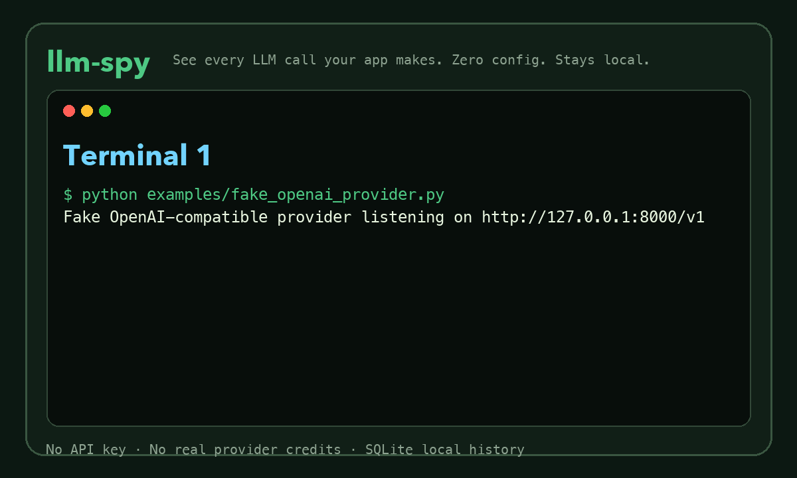
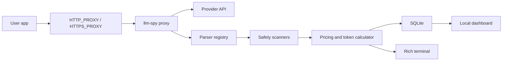

# llm-spy

[](pyproject.toml)
[](README.md)
[](LICENSE)

**See every LLM call your app makes. Zero config. Stays local.**

llm-spy is a local-first LLM API inspector for developers. Run your app through a standard HTTP/HTTPS proxy and llm-spy shows LLM requests, responses, latency, token usage, estimated cost, and safety warnings in your terminal and local dashboard.

Like Charles Proxy, but for AI apps.

No cloud account. No telemetry. No SDK instrumentation. Data stays in local SQLite.



## Try It Without An API Key

This is the fastest way to feel the product without spending real API credits.

Terminal 1: start a tiny fake OpenAI-compatible provider.

```bash
python examples/fake_openai_provider.py
```

Terminal 2: start llm-spy.

```bash
llm-spy start --port 8080
```

Terminal 3: send a request through the proxy.

```bash
HTTP_PROXY=http://localhost:8080 python examples/openai_compatible_example.py
```

Now inspect what happened:

```bash
llm-spy history
llm-spy dashboard
```

You should see the request, response, tokens, estimated cost, latency, and safety status. Nothing leaves your machine except the local request to the fake provider.

## Install

```bash
pip install llm-spy
```

For local development from this repo:

```bash
python -m venv .venv
source .venv/bin/activate
pip install -e ".[dev]"
```

## Use With A Real Provider

Start the proxy:

```bash
llm-spy start
```

Run your app through it:

```bash
HTTPS_PROXY=http://localhost:8080 HTTP_PROXY=http://localhost:8080 python app.py
```

For OpenAI:

```bash
OPENAI_API_KEY=... HTTPS_PROXY=http://localhost:8080 python examples/openai_example.py
```

For Anthropic:

```bash
ANTHROPIC_API_KEY=... HTTPS_PROXY=http://localhost:8080 python examples/anthropic_example.py
```

## HTTPS Interception

HTTP works immediately. HTTPS request/response body inspection requires your client to trust mitmproxy's local CA certificate.

1. Start llm-spy: `llm-spy start`.
2. In a browser or client routed through the proxy, open `http://mitm.it`.
3. Install/trust the mitmproxy CA for your platform.
4. Re-run your app with `HTTPS_PROXY=http://localhost:8080`.

If the CA is not trusted, HTTPS body capture will fail at the TLS layer. llm-spy does not pretend otherwise.

## If Nothing Shows Up

Run:

```bash
llm-spy doctor
```

Common fixes:

| Symptom | Try this |
| --- | --- |
| Empty history | Make sure the app was started with `HTTP_PROXY` or `HTTPS_PROXY`. |
| HTTPS errors | Trust the mitmproxy CA from `http://mitm.it`. |
| Localhost is bypassed | Clear `NO_PROXY` or run with `env -u NO_PROXY -u no_proxy ...`. |
| Port already in use | Start with `llm-spy start --port 18080`. |
| SDK ignores proxy | Configure the SDK transport explicitly or try the experimental SDK wrapper. |

## Demo Output

```text
╭──────── CALL #1 · openai-compatible · gpt-4o-mini · 1ms · $0.000115 ─────────╮
│ USER         Hello from the llm-spy zero-key demo                            │
│ RESPONSE     Fake provider saw: Hello from the llm-spy zero-key demo         │
│ TOKENS       prompt: 12  completion: 9  total: 21                            │
│ COST         input: 6e-05  output: 0.000135  total: $0.000195                │
│ SAFETY       PII: none                                                       │
│              Prompt injection: none                                          │
╰──────────────────────────────────────────────────────────────────────────────╯
```

## Dashboard

```bash
llm-spy dashboard
```

The dashboard runs at `http://localhost:4000` and reads your local SQLite database. It includes overview stats, calls, sessions, cost analytics, settings, search, and diff views. No login. No cloud.

## Features

| Feature | Status |
| --- | --- |
| HTTP proxy capture | Working |
| HTTPS proxy capture | Working after mitmproxy CA trust |
| Rich terminal display | Working |
| SQLite history | Working |
| Local dashboard | Working |
| Search/filter/history | Working |
| JSON/CSV export | Working |
| Promptfoo export | Best-effort |
| Cost estimation | Bundled pricing plus optional cache update |
| PII warnings | Local regex scanner |
| Prompt injection warnings | Local PromptShield pattern scanner |
| Replay | Experimental; requires provider API key in env |
| SDK mode | Experimental OpenAI wrapper |

## Provider Support

| Provider | Parser status | Notes |
| --- | --- | --- |
| OpenAI | Implemented | Chat completions, completions-like shapes, Responses API, tools, usage |
| Anthropic | Implemented | Messages API, system prompts, tools, usage, stop reason |
| Gemini | Implemented | generateContent, model path parsing, usage metadata |
| Mistral | Implemented | OpenAI-compatible chat |
| Ollama | Implemented | Local chat/generate, zero cost |
| Together AI | Implemented | OpenAI-compatible chat |
| OpenAI-compatible | Implemented | Generic `model` + `messages` or `prompt` shape |
| Cohere | Best effort | Common chat/message shapes |
| Unknown | Fallback | Raw request/response stored without crashing |

Streaming responses are captured after completion where the final body is available. Live token-by-token streaming display is not implemented yet.

## Architecture



## Privacy

llm-spy is local-first by design.

- Captured calls are stored in `~/.llm-spy/llm-spy.db` by default.
- No cloud sync.
- No accounts.
- No telemetry.
- Provider API keys are not stored.
- Replay reads API keys only from environment variables.

## Comparison

| Tool | Cloud needed | SDK instrumentation | Local-first | Terminal UI | Best fit |
| --- | --- | --- | --- | --- | --- |
| llm-spy | No | No | Yes | Yes | Local AI app debugging |
| Langfuse | Usually | Usually | Self-host possible | No | Product observability |
| LangSmith | Yes | Yes | No | No | LangChain tracing/evals |
| Helicone | Usually | Proxy/SDK | No | No | Hosted gateway observability |
| Custom logging | No | Yes | Depends | No | App-specific logs |

llm-spy is not trying to replace enterprise observability. It is the fast local inspection layer for Python developers, students, indie hackers, technical founders, and QA engineers who want to see what their AI app is actually doing.

## Limitations

- HTTPS inspection requires mitmproxy CA trust.
- Safety scanners are pattern-based warnings, not guarantees.
- Cost estimation depends on known pricing and provider usage fields.
- Replay and SDK mode are experimental.
- Promptfoo export is best-effort.

## Roadmap

- `0.1.x`: harden proxy capture, docs, tests, and provider fixtures.
- `1.0`: stable dashboard, broader provider coverage, better streaming handling, stronger packaging guarantees.
- `2.0`: deeper safety checks, replay hardening, CI workflows, promptfoo export improvements.
- `3.0`: VS Code extension, plugin ecosystem, benchmarking, custom adapters.

## Contributing

See [CONTRIBUTING.md](CONTRIBUTING.md) and [docs/contributing_parsers.md](docs/contributing_parsers.md).

Good first issues: Bedrock parser, Azure OpenAI parser, DeepSeek parser, Groq parser, better streaming reconstruction, terminal themes, Windows proxy setup docs, promptfoo export improvements, LlamaIndex/LiteLLM docs, and more pricing data.

Suggested GitHub topics: `llm`, `openai`, `anthropic`, `developer-tools`, `debugging`, `proxy`, `cli`, `python`.

Suggested GitHub description: “Zero-config LLM call inspector. See every API call your AI app makes.”

## Demo Recording

See [docs/demo_recording.md](docs/demo_recording.md) for VHS and terminalizer instructions.

## License

MIT.
