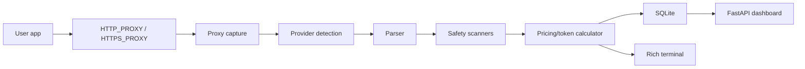

# Architecture

llm-spy is a local proxy plus a normalization pipeline.

The parser registry keeps providers isolated. Storage is SQLite at `~/.llm-spy/llm-spy.db` by default. The dashboard reads the same local database and does not require login.

Privacy model: llm-spy does not send captured data anywhere. Exports are explicit user actions.
